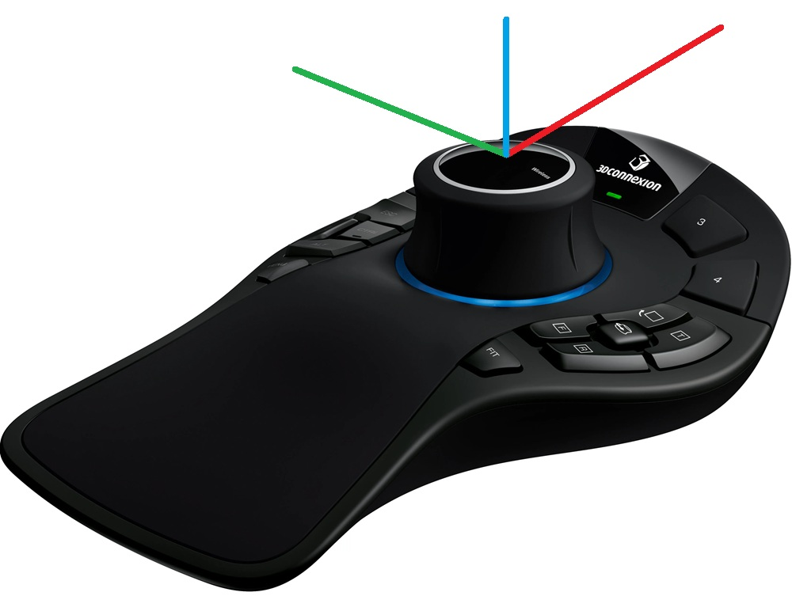

# 3DConnexion SpaceMouse ROS2 Dashboard

ROS2 package that reads 3Dconnexion SpaceMouse data and provides a real-time web dashboard for visualization. Includes the [`spacenav`](https://github.com/ros-drivers/joystick_drivers/tree/ros2/spacenav) driver — no external dependencies to clone.

Can be used **standalone** or as a **git submodule** inside an existing workspace.

## Coordinate System



> **Tip:** For the most intuitive control, align the coordinate system of your control target (e.g. robot end-effector) with the SpaceMouse. When the axes match, pushing the SpaceMouse forward moves the target forward, and rotating it maps directly to the target's rotation — matching natural human expectation.

## Features

- Includes the `spacenav` ROS2 driver — no extra repos to clone
- Web dashboard with live 3D cube preview responding to 6-DOF input
- Real-time axis bar charts (linear + angular)
- Named button panel laid out like the physical SpaceMouse Pro (15 buttons)
- Raw joystick value readout
- Configurable via launch arguments or YAML

## Prerequisites

```bash
# spacenavd daemon and library (required by the spacenav driver)
sudo apt install spacenavd libspnav-dev
```

> **SpaceMouse Pro buttons need `spacenavd` ≥ 1.1** (verified with **1.3.1**).
> The Ubuntu-packaged `spacenavd` **0.7.1** (22.04 Jammy) lacks the SpaceMouse
> Pro button remap (`bnhack_smpro`), so it reports the wrong button indices
> (e.g. pressing `1` lights up `Alt`). The **axes are unaffected**, and this is
> **not** a virtual-machine issue — it is purely the daemon version. Build a
> current `spacenavd` from source:
>
> ```bash
> sudo apt remove --purge spacenavd                       # remove broken 0.7.1 (keeps libspnav)
> sudo apt install build-essential git libx11-dev libxi-dev
> git clone --branch v1.3.1 https://github.com/FreeSpacenav/spacenavd.git
> cd spacenavd && ./configure && make
> sudo make install                                       # -> /usr/local/bin/spacenavd
> sudo cp contrib/systemd/spacenavd.service /etc/systemd/system/
> sudo systemctl daemon-reload && sudo systemctl enable --now spacenavd
> ```
>
> Verify with `tail /var/log/spnavd.log` — a working daemon logs
> `reports 15 buttons before disjointed button remapping`.

## Installation

### Standalone

```bash
mkdir -p ~/spacemouse_ws/src
cd ~/spacemouse_ws/src
git clone <this-repo-url> 3dconnexion_ros2
cd ~/spacemouse_ws
colcon build --symlink-install
source install/setup.bash
```

### As a submodule

```bash
cd ~/your_ws/src
git submodule add <this-repo-url> 3dconnexion_ros2
cd ~/your_ws
colcon build --symlink-install
source install/setup.bash
```

## Usage

> **Note:** The `spacenavd` daemon starts automatically on boot after installation.
> If it's not running, start it with `sudo systemctl start spacenavd`.

### Launch everything (SpaceMouse + Dashboard)

```bash
ros2 launch spacemouse spacemouse.launch.py dashboard_port:=8080
```

Then open **http://localhost:8080** in your browser.

### Launch individually

```bash
# SpaceMouse driver only (no dashboard)
ros2 launch spacemouse spacemouse.launch.py

# Dashboard only (spacenav must already be running)
ros2 launch spacemouse dashboard.launch.py
```

### Launch arguments

| Argument         | Default | Description                                              |
|------------------|---------|----------------------------------------------------------|
| `dashboard_port` | (empty) | `spacemouse.launch.py`: if set (e.g. `8080`), also start the dashboard on this port. Empty = driver only. |
| `enable_pose`    | `true`  | `spacemouse.launch.py`: start the `pose_node` pose publisher. |
| `pose_frequency` | `100.0` | `spacemouse.launch.py`: pose publish rate (Hz). |
| `max_trans_speed`| `0.1`   | `spacemouse.launch.py`: translation speed (m/s) at axis = 1. |
| `max_rot_speed`  | `1.0`   | `spacemouse.launch.py`: rotation speed (rad/s) at axis = 1. |
| `integration_frame` | `world` | `spacemouse.launch.py`: accumulate deltas in `body` or `world` frame. |
| `http_port`      | `8080`  | `dashboard.launch.py`: HTTP port for the web UI + data.  |

```bash
ros2 launch spacemouse spacemouse.launch.py dashboard_port:=3000
```

## Topics

Subscribed by the dashboard (published by the `spacenav` driver):

| Topic                  | Type                          | Description                        |
|------------------------|-------------------------------|------------------------------------|
| `spacenav/twist`       | `geometry_msgs/msg/Twist`     | Combined linear + angular velocity |
| `spacenav/offset`      | `geometry_msgs/msg/Vector3`   | Linear offset (scaled)             |
| `spacenav/rot_offset`  | `geometry_msgs/msg/Vector3`   | Angular offset (scaled)            |
| `spacenav/joy`         | `sensor_msgs/msg/Joy`         | Raw axes + fixed 15-button array (see [Buttons](#buttons-spacemouse-pro)) |

### Pose output

The `pose_node` integrates the normalized axes into ready-to-use poses
(translation vector + quaternion), published at a fixed rate (`pose_frequency`,
default 100 Hz). It runs by default and works independently of the dashboard.

| Topic                 | Type                            | Direction  | Description |
|-----------------------|---------------------------------|------------|-------------|
| `spacenav/curr_pose`  | `geometry_msgs/msg/PoseStamped` | published  | Accumulated pose |
| `spacenav/delta_pose` | `geometry_msgs/msg/PoseStamped` | published  | Per-tick incremental pose |
| `spacenav/set_pose`   | `geometry_msgs/msg/PoseStamped` | subscribed | Explicitly reset `curr_pose` |

Each tick advances by `axis × max_speed / pose_frequency` — e.g. with
`max_trans_speed = 0.1` m/s at 100 Hz, a fully deflected axis moves `0.001` m per
message. `curr_pose` is the running accumulation of `delta_pose`.

**Parameters** (on `pose_node`; settable at launch and at runtime via
`ros2 param set` or the dashboard sliders):

| Parameter | Default | Description |
|-----------|---------|-------------|
| `publish_frequency` | `100.0` | Output rate (Hz) |
| `max_trans_speed` | `0.1` | Translation speed (m/s) at axis = 1 |
| `max_rot_speed` | `1.0` | Rotation speed (rad/s) at axis = 1 |
| `integration_frame` | `world` | Accumulate deltas in `body` or `world` frame |
| `deadzone` | `0.0` | Ignore axis magnitudes below this (`0`–`1`) |
| `input_timeout` | `0.5` | Zero the input if no `joy` arrives for this long (s); `0` disables |
| `input_topic` | `spacenav/joy` | Source axes topic |
| `pose_frame_id` | `spacenav_origin` | `header.frame_id` of the poses |
| `publish_tf` | `false` | Also broadcast `curr_pose` on TF |

#### ROS API examples

Everything the dashboard does is plain ROS 2, so you can script it headless. The
pose publisher runs as the node `/pose_node` — adjust the path below if you
rename the node or run it under a namespace.

**Inspect parameters**

```bash
ros2 param list /pose_node                  # all parameter names
ros2 param get  /pose_node max_trans_speed  # read one value
ros2 param dump /pose_node                  # print current values as YAML
```

**Set parameters (live — no restart)**

```bash
# translation / rotation speed at full axis deflection
ros2 param set /pose_node max_trans_speed 0.2     # m/s
ros2 param set /pose_node max_rot_speed   0.5     # rad/s

# output rate and accumulation frame
ros2 param set /pose_node publish_frequency 200.0 # Hz
ros2 param set /pose_node integration_frame body  # 'body' or 'world'

# ignore small inputs, or broadcast the pose on TF
ros2 param set /pose_node deadzone   0.05
ros2 param set /pose_node publish_tf true         # publishes curr_pose on /tf
```

Set several at once from a file:

```bash
cat > pose_params.yaml <<'EOF'
/pose_node:
  ros__parameters:
    max_trans_speed: 0.15
    max_rot_speed: 0.6
    integration_frame: body
EOF
ros2 param load /pose_node pose_params.yaml
```

**Set the pose** — publish a `geometry_msgs/msg/PoseStamped` on
`spacenav/set_pose`; `curr_pose` jumps to it and keeps integrating from there.

```bash
# reset to identity (origin, no rotation)
ros2 topic pub --once spacenav/set_pose geometry_msgs/msg/PoseStamped \
  '{pose: {orientation: {w: 1.0}}}'

# position only — (0.5, 0.0, 0.2), no rotation
ros2 topic pub --once spacenav/set_pose geometry_msgs/msg/PoseStamped \
  '{pose: {position: {x: 0.5, y: 0.0, z: 0.2}, orientation: {w: 1.0}}}'

# position + orientation — quaternion for 45° about Z (yaw)
ros2 topic pub --once spacenav/set_pose geometry_msgs/msg/PoseStamped \
  '{pose: {position: {x: 0.5, y: 0.0, z: 0.2},
           orientation: {x: 0.0, y: 0.0, z: 0.3827, w: 0.9239}}}'

# include an explicit header frame
ros2 topic pub --once spacenav/set_pose geometry_msgs/msg/PoseStamped \
  '{header: {frame_id: spacenav_origin},
    pose: {position: {x: 1.0, y: 0.0, z: 0.0}, orientation: {w: 1.0}}}'
```

> **Orientation is a quaternion `(x, y, z, w)`.** For a single rotation of `θ`
> about one axis, `w = cos(θ/2)` and that axis's component `= sin(θ/2)`:
>
> | Rotation            | x | y | z | w |
> |---------------------|---|---|---|---|
> | none                | 0 | 0 | 0 | 1 |
> | 45° about Z (yaw)   | 0 | 0 | 0.3827 | 0.9239 |
> | 90° about Z (yaw)   | 0 | 0 | 0.7071 | 0.7071 |
> | 90° about Y (pitch) | 0 | 0.7071 | 0 | 0.7071 |
> | 90° about X (roll)  | 0.7071 | 0 | 0 | 0.7071 |

**Watch the result**

```bash
ros2 topic echo spacenav/curr_pose    # accumulated pose
ros2 topic echo spacenav/delta_pose   # per-tick increment
```

The dashboard's **Current Pose** panel mirrors all of this: the **Control** card
has editable `x/y/z` + `roll/pitch/yaw` offset fields with **Set Offset** / **Set
Identity** buttons (which publish to `spacenav/set_pose`) and live speed sliders
(which call `ros2 param set` under the hood).

## Buttons (SpaceMouse Pro)

This package targets the **3Dconnexion SpaceMouse Pro** (15 buttons). The
`spacenav` driver reports button state in `spacenav/joy` as a **fixed-width**
`sensor_msgs/msg/Joy` `buttons[]` array (`1` = pressed, `0` = released). Every
index always maps to the same physical button, so each message reflects the
status of every button — they no longer appear only after first being pressed.

| Index | Button          | Group        |
|-------|-----------------|--------------|
| 0     | `1`             | Function key |
| 1     | `2`             | Function key |
| 2     | `3`             | Function key |
| 3     | `4`             | Function key |
| 4     | Menu            | Menu         |
| 5     | Fit             | Fit          |
| 6     | T (top view)    | QuickView    |
| 7     | R (right view)  | QuickView    |
| 8     | F (front view)  | QuickView    |
| 9     | Roll view       | QuickView    |
| 10    | Rotation toggle | Rotation     |
| 11    | Esc             | Modifier     |
| 12    | Alt             | Modifier     |
| 13    | Shift           | Modifier     |
| 14    | Ctrl            | Modifier     |

The dashboard's **Buttons** panel arranges these **radially, matching the
physical device**: the function keys (`1`–`4`) arc over the top, the keyboard
modifiers (`Esc` / `Shift` / `Ctrl` / `Alt`) and `Menu` sit to the left of the
cap, the four QuickView keys form a 2×2 with the **rotation toggle in its
center** (and `Fit` below) to the right of the cap, and the controller cap sits
in the middle. Each named key lights up when it is pressed.

> **Notes**
> - The fixed width is set by the `spacenav_node` parameter `num_buttons`
>   (default `15`). The array still grows automatically if a device ever reports
>   a higher index.
> - The contiguous `0–14` mapping above is produced by `spacenavd` **≥ 1.1**
>   (verified with **1.3.1**) for the SpaceMouse Pro, via its `bnhack_smpro`
>   remap. The Ubuntu-packaged `spacenavd` **0.7.1** lacks this and mis-maps the
>   Pro's buttons (sparse indices, e.g. `1` shows as `Alt`) — install a current
>   `spacenavd` (see [Prerequisites](#prerequisites)) if your buttons don't line
>   up with the table.

### Known limitation — multi-button ghosting

Pressing **three or more buttons at once** can light up a **phantom button** you
did not press (and some combinations drop or swap a real one). Examples observed
directly on the raw `spacenav/joy` topic:

| Buttons pressed | Reported on topic |
|-----------------|-------------------|
| 0 + 1 + 2       | 0, 1, 2, **9**    |
| 0 + 1 + 3       | 0, 1, 3, **6**    |
| 0 + 1 + 9       | 0, 1, **7**       |

Pressing **one or two** buttons is always reported correctly.

This is **button-matrix ghosting** — a hardware characteristic of the SpaceMouse
Pro, whose buttons share a row/column matrix without full N-key rollover (no
anti-ghost diodes). It is **not a bug in this package**: the phantom is already
present in the data coming from the device, below both `spacenavd` and the
`spacenav` driver, which only pass each button's state through individually.
Because a ghost is electrically indistinguishable from a real press, it cannot be
reliably filtered in software — so **avoid relying on 3+ simultaneous button
presses**.

## Package structure

```
3dconnexion_ros2/
├── .gitignore
├── spacenav/                          # spacenav driver (from joystick_drivers)
│   ├── cmake/FindSPNAV.cmake
│   ├── include/spacenav/spacenav.hpp
│   ├── src/spacenav.cpp
│   ├── launch/classic-launch.py
│   ├── CMakeLists.txt
│   └── package.xml
├── spacemouse/                        # SpaceMouse driver-launch + dashboard package
│   ├── config/
│   │   └── spacenav_params.yaml
│   ├── launch/
│   │   ├── spacemouse.launch.py       # driver (+ dashboard if dashboard_port set)
│   │   └── dashboard.launch.py        # dashboard only
│   ├── spacemouse/
│   │   ├── __init__.py
│   │   ├── dashboard_node.py
│   │   └── pose_node.py
│   ├── web/
│   │   └── index.html
│   ├── resource/spacemouse
│   ├── package.xml
│   ├── setup.py
│   └── setup.cfg
└── README.md
```

## License

MIT
